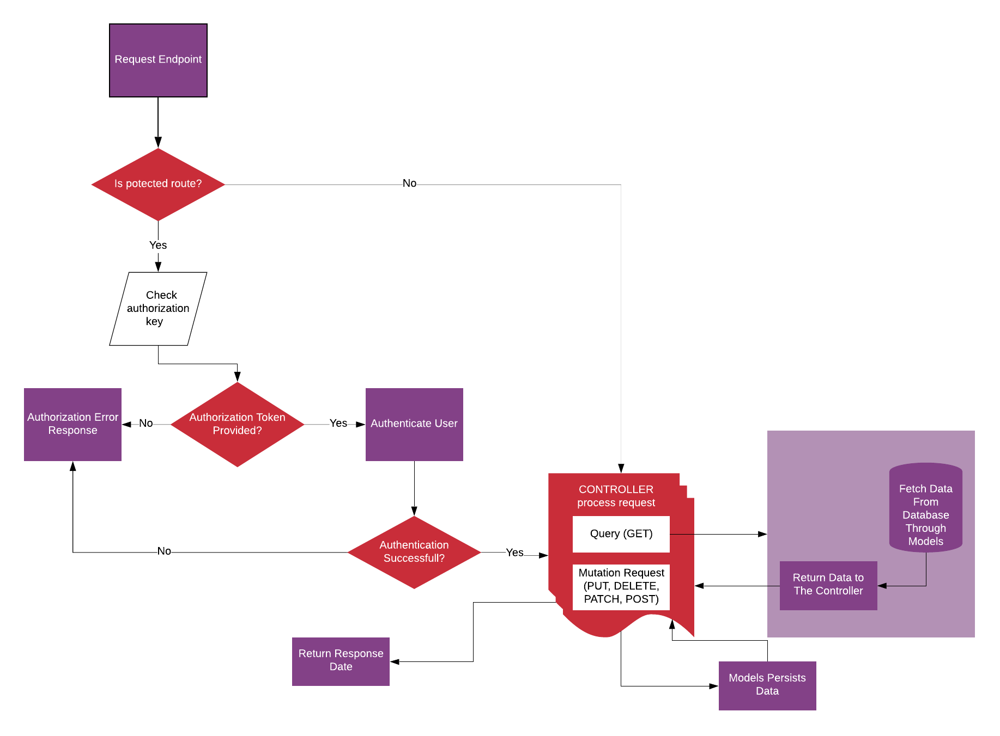

# DevMentor API

> Backend Api for DevMentor application which is a bootcamp directory. You can checkout the specs for this API [DevMentor API Specs](https://docs.google.com/document/d/1ZpYxx2H4kjCCHIVc4wXK1DKvm13llQs9j27bDX_rQ_0/edit?usp=sharing) . And you can check out the API [DevMentor API](https://devmentor.host)

## API FLOW

The flow of actions across the API can best be described with this diagram.


## Usage

Rename "config/config.env.env" to "config/config.env" and update the values/settings to your own.

## Install Dependencies

```
npm install
```

## Run App

```
# run in development
npm run dev

#run in production
npm start
```

- version: 1.0.0
- licence: MIT
